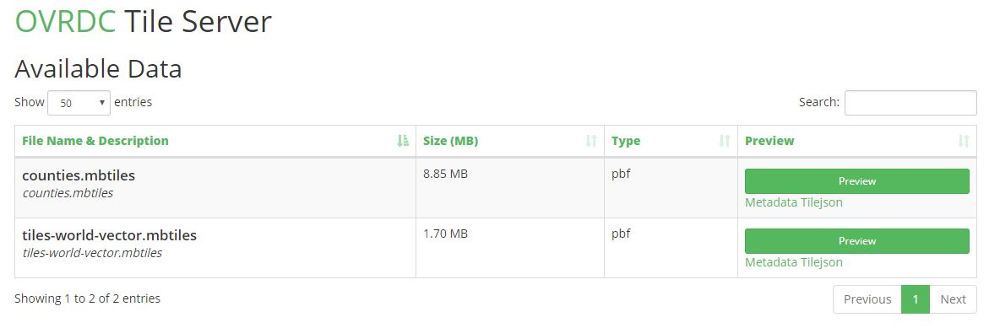
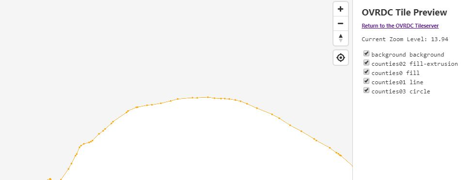

ovrdc-tileserver
==============

<<<<<<< HEAD
This is fork of Tobin Bradley's mbtiles-server which is a fork of Christopher Helm's [mbtiles-server](https://github.com/chelm/mbtiles-server) - see below for Tobin Bradley's description.

These results using ```loadtest``` are from the smallest Digital Ocean droplet requesting one pbf file from an mbtiles file, proxied with NGINX. An average map takes around 30-70 requests to render. Is this good? Seems like it, especially for smaller municipal government apps, which is our domain.

```
 INFO Max time (s):        10
 INFO Concurrency level:   100
 INFO Agent:               keepalive
 INFO
 INFO Completed requests:  5942
 INFO Total errors:        0
 INFO Total time:          10.00227345 s
 INFO Requests per second: 594
 INFO Mean latency:        166.3 ms
 INFO
 INFO Percentage of the requests served within a certain time
 INFO   50%      140 ms
 INFO   90%      180 ms
 INFO   95%      210 ms
 INFO   99%      897 ms
 INFO  100%      3278 ms (longest request)

```
=======

>>>>>>> 520f68dd3ba6cd33fee6d2af4af83218ea385365

This is fork of Tobin Bradley's mbtiles-server which is a fork of Christopher Helm's [mbtiles-server](https://github.com/chelm/mbtiles-server) - see below for Tobin Bradley's description. This server adds a tile preview page (below) and tile catalog page (above). A server statistics page is in testing.



These results using ```loadtest``` are from the second smallest Digital Ocean droplet requesting one pbf file from an mbtiles file, proxied with NGINX. An average map takes around 30-70 requests to render. Is this good? Seems like it, especially for smaller municipal government apps, which is our domain.

```
 INFO Max time (s):        10
 INFO Concurrency level:   100
 INFO Agent:               keepalive
 INFO 
 INFO Completed requests:  10120
 INFO Total errors:        0
 INFO Total time:          10.000816574 s
 INFO Requests per second: 1012
 INFO Mean latency:        96.9 ms
 INFO 
 INFO Percentage of the requests served within a certain time
 INFO   50%      82 ms
 INFO   90%      123 ms
 INFO   95%      133 ms
 INFO   99%      480 ms
 INFO  100%      3220 ms (longest request)

```

This fork also uses some code from tilehut, another great implementation of an mbtiles server.

Add mbtiles to the ```tiles``` folder then start the server. All mbtiles will be served. It works with raster and vector tiles.

``` bash
npm install
node tileserver.js
```

Requests look like this:

``` text
http://localhost:3000/<mbtiles-name>/3/1/2.png.
```
